# UD1 - ARQUITECTURES I TECNOLOGIES WEB

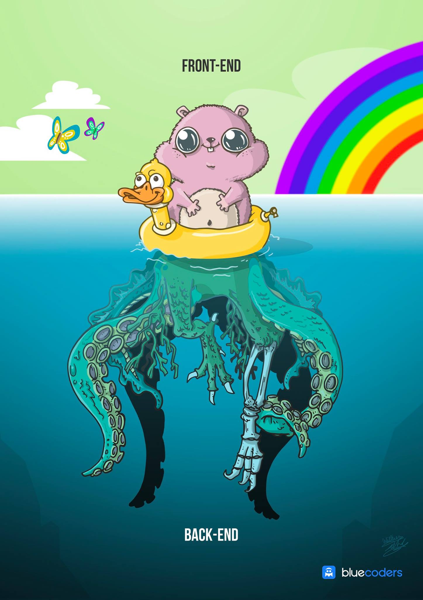{ width=50% style="display:block; margin:auto;" }

## SONDEIG INICIAL

- Què és Internet?
- Què és la pila de protocols TCP/IP?
- Quin protocol de nivell d'aplicació s'utilitza a Internet? Quina és la versió segura d'aquest protocol?
- Què és una adreça IP? Què és un port IP?
- Quantes versions del protocol IP coneixes?
- Què és una URL? Mitjançant quin protocol/servei es relaciona un domini amb una adreça IP?
- Què és una pàgina web? Què és una aplicació web? Què és un lloc web? Què és una arquitectura web?
- Quina diferència hi ha entre una pàgina web estàtica i una dinàmica? Les pàgines web que has desenvolupat durant el primer curs, eren estàtiques o dinàmiques?
- Quina diferència hi ha entre la web 1.0 i la web 2.0?
- Un navegador web, què és exactament? Quina és la seua funció? Quants en coneixes? Hi ha diferències entre ells?
- Quina creus que és la principal diferència entre una aplicació web i una aplicació nativa? Has sentit parlar de les aplicacions híbrides? Coneixes exemples d'aplicacions que tinguen una versió web i la seua corresponent nativa (app mòbil)?
- Coneixes els termes "back-end" i "front-end"? Quin correspon al desenvolupament servidor i quin al desenvolupament en client? Quines idees t'inspira la imatge de la portada d'aquest document?
- Coneixes els termes "back-office" i "front-office"? Quina és la diferència?

## AVALUACIÓ

El present document, juntament amb el seu corresponent butlletí d'activitats (publicat addicionalment), cobreix els següents criteris d'avaluació:

PART SERVIDOR

| RESULTATS D'APRENENTATGE | CRITERIS D'AVALUACIÓ |
|--------------------------|----------------------|
| **RA1**. Selecciona les arquitectures i tecnologies de programació web en entorn servidor, analitzant les seues capacitats i característiques pròpies. | a) S'han caracteritzat i diferenciat els models d'execució de codi en el servidor i en el client web. b) S'han reconegut els avantatges que proporciona la generació dinàmica de pàgines. c) S'han identificat els mecanismes d'execució de codi en els servidors web. d) S'han reconegut les funcionalitats que aporten els servidors d'aplicacions i la seua integració amb els servidors web. e) S'han identificat i caracteritzat els principals llenguatges i tecnologies relacionats amb la programació web en entorn servidor. f) S'han verificat els mecanismes d'integració dels llenguatges de marques amb els llenguatges de programació en entorn servidor. g) S'han reconegut i avaluat les eines i frameworks de programació en entorn servidor. |

PART CLIENT

| RESULTATS D'APRENENTATGE | CRITERIS D'AVALUACIÓ |
|--------------------------|----------------------|
| **RA1**. Selecciona les arquitectures i tecnologies de programació sobre clients web, identificant i analitzant les capacitats i característiques de cadascuna. | a) S'han caracteritzat i diferenciat els models d'execució de codi en el servidor i en el client web. b) S'han identificat les capacitats i mecanismes d'execució de codi dels navegadors web. c) S'han identificat i caracteritzat els principals llenguatges relacionats amb la programació de clients web. d) S'han reconegut les particularitats de la programació de guions i els seus avantatges i desavantatges sobre la programació tradicional. e) S'han verificat els mecanismes d'integració dels llenguatges de marques amb els llenguatges de programació de clients web. f) S'han reconegut i avaluat les eines de programació i prova sobre clients web. |

## ARQUITECTURES WEB

Les arquitectures web descriuen la relació entre els diferents elements que participen en l'intercanvi i el processament d'informació a través d'Internet, així com les seues funcions.

La gran majoria de les arquitectures web actuals són de tipus **client-servidor**: una comunicació asimètrica en la qual un dels extrems ofereix un o més serveis i l'altre fa ús d'aquests. Aquesta és l'arquitectura sobre la qual ens centrarem, encara que existeixen altres com la [Punt a Punt (P2P - Peer to Peer)](https://es.wikipedia.org/wiki/Peer-to-peer).

### Arquitectura Client-Servidor

El model client-servidor és un model que reparteix tasques entre els proveïdors d'un recurs o servei, anomenats **servidors**, i els sol·licitants o consumidors del servei, anomenats **clients**.

El més freqüent és que els clients i els servidors es comuniquen a través d'una xarxa de comunicacions, però ambdós poden residir en la mateixa màquina (normalment en tasques de desenvolupament).

L'esquema de funcionament més bàsic del model client-servidor per a una arquitectura web està basat en un o diversos clients que sol·liciten una pàgina web a un servidor web:

1. Des del navegador web (o agent d'usuari, que pot ser també una app nativa o fins i tot un altre servidor) l'usuari sol·licita un servei web indicant la seua URL.
2. El servidor rep la **petició** mitjançant el protocol d'aplicació HTTP, i la processa mitjançant la seua **lògica de negoci**.
3. Produeix una **resposta** HTTP a la petició, que envia al client. Aquesta resposta pot contenir **fitxers** de diversa naturalesa: HTML, CSS, XML, JSON, fitxers multimèdia, codi JavaScript, etc.
4. El navegador web rep la informació enviada pel servidor i la interpreta. En funció de la resposta enviada, es representa en el navegador la resposta a l'usuari (normalment en forma de pàgina web).

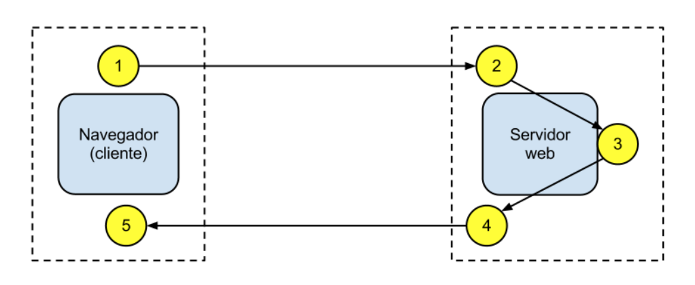

Avantatges:

- **Centralització** del control: els accessos, recursos i la integritat de les dades són controlats pel servidor. Aquesta centralització també facilita la tasca d'actualitzar dades o altres recursos.
- **Escalabilitat**: es pot augmentar la capacitat de clients i servidors per separat. Qualsevol element pot ser augmentat (o millorat) en qualsevol moment, o es poden afegir nous nodes a la xarxa (clients i/o servidors), sempre que el sistema estiga dissenyat per a això.
- **Portabilitat**: el fet que l'aplicació web s'execute en un navegador web fa que s'independitze el programari del sistema operatiu sobre el qual s'executa. D'aquesta manera, s'aprofita el desenvolupament per a les diferents plataformes.
- Fàcil **manteniment**: en estar distribuïdes les funcions i responsabilitats entre diversos ordinadors independents, és possible reemplaçar, reparar, actualitzar, o fins i tot traslladar un servidor, mentre que els seus clients no es veuran afectats per aquest canvi (o s'afectaran mínimament). Aquesta independència dels canvis també es coneix com a **encapsulació**.
- Existeixen **tecnologies** prou desenvolupades, dissenyades per al model client-servidor que asseguren la seguretat en les transaccions, la **usabilitat** de la interfície i la facilitat d'ús.

Desavantatges:

- La **congestió** del trànsit ha estat sempre un problema en aquesta arquitectura. Quan una gran quantitat de clients envien peticions simultànies al mateix servidor, es poden produir situacions de sobrecàrrega.
- Quan un servidor està caigut, les peticions dels clients **no poden ser satisfetes**, ja que els recursos no estan distribuïts.
- El programari i el maquinari d'un servidor són generalment molt determinants. Normalment es necessita **programari i maquinari específic**, depenent del tipus de servei web, sobretot en el costat del servidor. Això augmentarà el cost. Com a alternativa, es disposa de serveis web al núvol, amb diversos tipus de costos dependents de l'arquitectura web.

*NOTA*: aquestes desavantatges es refereixen al cas en què els recursos del servidor no estan replicats i/o distribuïts. Actualment existeixen tècniques d'escalat horitzontal i vertical que poden solucionar aquests problemes.

### Peticions des del navegador: exemple pràctic

En aquest apartat anem a aprofundir en què succeeix realment quan consultem una URL. Observarem, a través de les eines de desenvolupador del navegador web de Chrome (també serveix Firefox o qualsevol altre), els 4 passos que es detallaven en l'apartat anterior.

Per a això utilitzarem la pàgina web de l'ajuntament d'Elx (www.elche.es).

1. Obrim una pestanya del navegador web i introduïm la URL www.elche.es.

A continuació obrim les eines de desenvolupador i anem a la pestanya Network (o Xarxa):

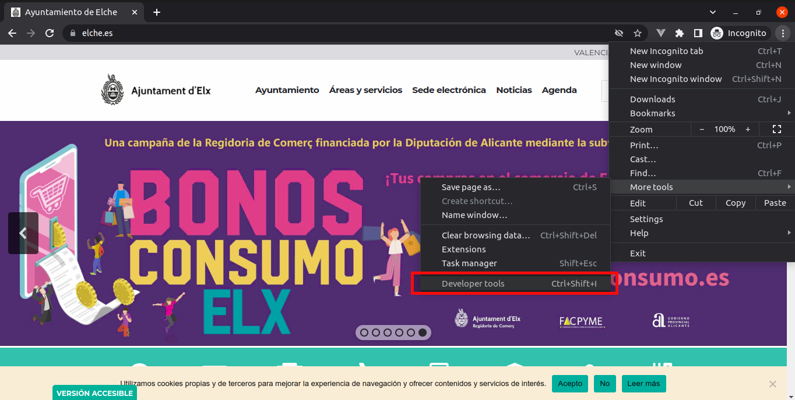

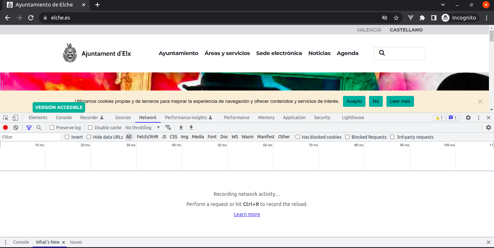

En aquests moments encara no hi ha dades, perquè no hem fet una petició al servidor amb la finestra d'eines de desenvolupador activa. Per tant, refresquem la pàgina (equivalent a fer una petició al servidor que gestiona www.elche.es) i passem al punt següent.

2. El servidor rep la petició mitjançant el protocol d'aplicació HTTP, i la processa mitjançant la seua lògica de negoci.

Realment no podem saber exactament què està succeint al servidor durant aquest pas, a no ser que tinguérem accés al mateix, amb els privilegis i eines correctes, però sí que podem esbrinar moltes dades mitjançant eines com:

- [whois](https://who.is/dns/elche.es): ens indica, entre altres dades, que la IP del servidor és 217.13.88.8 (registre DNS de tipus A).
- [builtwith](https://builtwith.com/detailed/elche.es): ens indica, entre altres coses, que la plataforma web disposa de dos servidors web (Apache i nginx).

**ATENCIÓ**: Existeixen altres mètodes per conéixer més dades sobre el servidor que podrien implicar pràctiques il·legals, en l'àmbit de la ciberseguretat.

Aquest pas es duria a terme en el que s'anomena **Back-end**.

Vegem el resultat en el següent pas.

3. El servidor produeix una resposta a la petició del client, que l'envia a través d'internet i la recupera el nostre navegador.

Ara, si consultem la pestanya Network després de refrescar la URL, podrem veure que han aparegut molts registres, el primer dels quals té com a nom "www.elche.es":

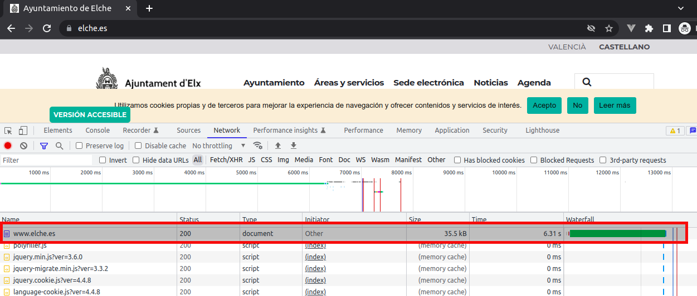

Aquest registre correspon a la primera petició que hem realitzat al servidor de www.elche.es. Si fem clic sobre ell podrem veure tant les dades de la petició realitzada, com la resposta enviada pel servidor a través d'Internet, mitjançant HTTP. Es pot veure que el codi retornat pel servidor és 200 (en color verd, senyal que no hi ha hagut error), i ha respost un servidor web nginx:

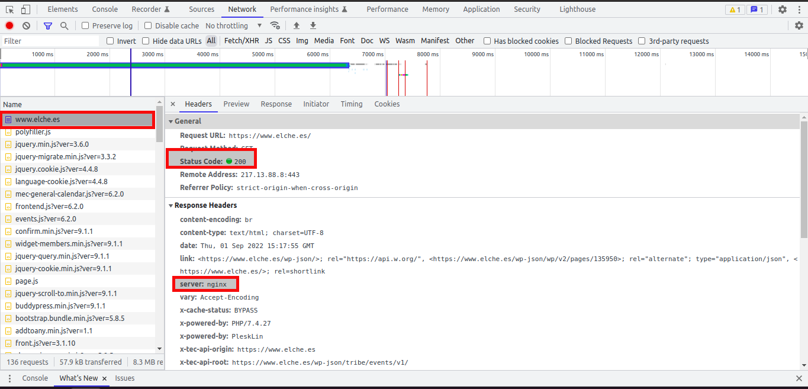

> *NOTA*: el servidor pot enviar també la seua versió de programari, però això podria comportar atacs maliciosos, depenent de les vulnerabilitats d'aquesta versió. És per això que és una bona pràctica configurar el servidor web perquè no envie aquesta versió (entre altres aspectes).

Més avall, en la mateixa resposta, ens indica els paràmetres amb què s'ha realitzat la petició. Entre aquests, podem veure el tipus de petició que hem fet (GET), la versió del nostre navegador web, el llenguatge en què volem rebre la informació, entre altres detalls:

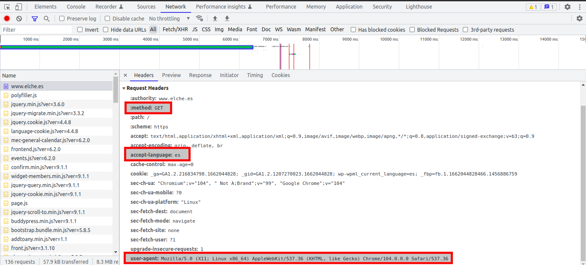

La petició ha tardat (en la prova actual) 6.31 segons a resoldre's, i ha desembocat en una transferència per part del servidor d'un total de 136 respostes i 57.9 kB transferits (entre altres mètriques):

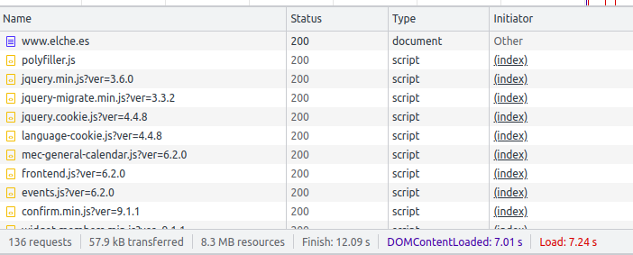

La resta de registres que estan sota l'inicial corresponen a tots els recursos (fitxers HTML, JavaScript, arxius multimèdia, etc.) necessaris perquè el navegador represente la pàgina web. Per exemple, si fem clic sobre el segon registre "polyfiller.js", i fem clic sobre la pestanya "Preview" del panell de la dreta, podrem veure el codi JavaScript que conté aquest fitxer transferit:

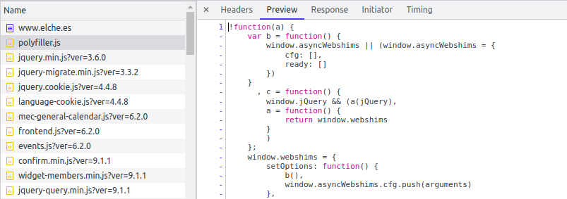

"Logo-ayto-elche-nuevo.png" podrem veure que és el logo de l'ajuntament, transferit des del servidor:

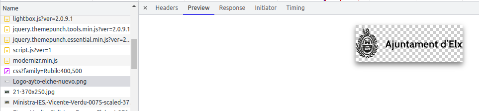

Tots aquests fitxers tarden un temps a transferir-se, el que es representa en forma de waterfall (cascada):

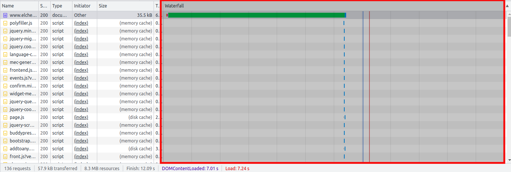
La petició que més tarda a resoldre's és la primera, segons aquest gràfic.

Et recorda això a algun tipus de programa de descàrregues tipus BitTorrent o similars? Doncs sí, en aquest cas es podria pensar en el navegador web com si fora un gestor de descàrregues (salvant les diferències), que s'encarrega de recuperar tots els fitxers que necessita per representar la pàgina web que se li ha sol·licitat.

4. El navegador web rep la informació enviada pel servidor i la interpreta. En funció de la resposta enviada, es representa en el navegador la resposta a l'usuari (normalment en forma de pàgina web).

El navegador web és un programari dissenyat per interpretar tot el contingut enviat per un servidor web, i representar-lo en la pantalla perquè l'usuari final puga consultar la informació rebuda, interaccionar amb la pàgina web, o també gestionar les operacions de l'usuari que requerisquen noves peticions al servidor web (en cas de pàgines web dinàmiques, o aplicacions web).

Per això, el navegador web prendrà tots els fitxers descarregats i conformarà la pàgina de benvinguda de www.elche.es, el que s'anomena **Front-end**:

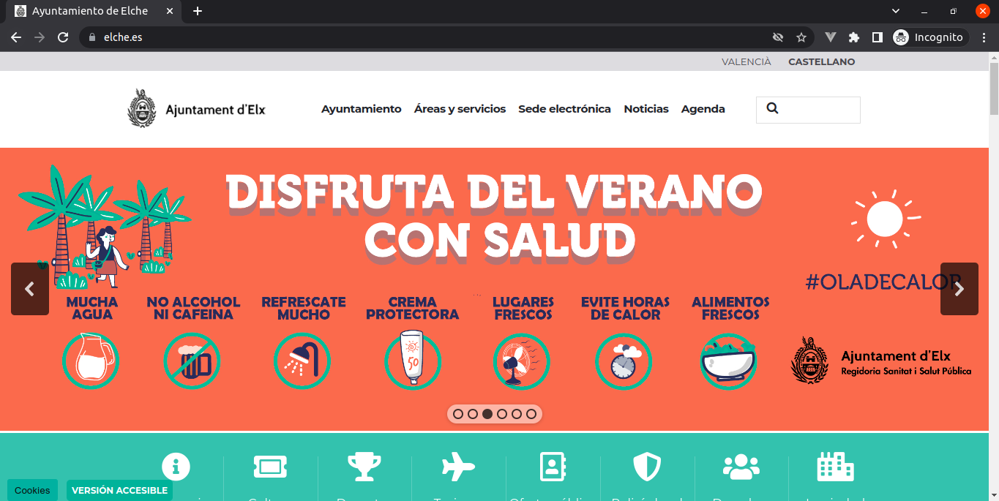

Encara penses que és correcte dir "navegar per Internet"?

### Model actual d'Arquitectura web

El model actual d'arquitectura web és un tipus concret de l'arquitectura client-servidor, en la qual els components i els recursos d'una aplicació es separen segons els següents nivells:

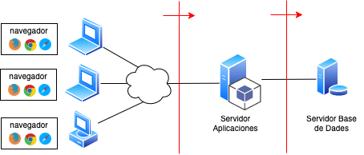

1. Una **capa client**: generalment és el navegador web executant-se en el dispositiu de l'usuari final, encara que també pot tractar-se d'aplicacions natives, d'escriptori o altres sistemes, que requereixen respostes en forma de fitxers de text pla amb llenguatges de marques (XML, JSON).

2. Un servidor web i/o servidor d'aplicacions (**capa de negoci**): la capa client pot accedir a diferent lògica i procediments que existeixen en la capa de negoci. Ací la lògica pot ser molt més complexa que en la capa anterior. Els components d'aquesta capa poden ser des de simples fitxers HTML, servlets de Java, fitxers PHP, Python, etc.

3. Una **capa de dades**: es compon d'un sistema d'emmagatzematge i accés a dades que s'utilitzen per confeccionar la resposta que s'envia de tornada al client. Generalment és un gestor o gestors de bases de dades (relacionals o no relacionals), però poden ser fitxers de text pla, fitxers XML, JSON, etc.

La capa de negoci pot estar al seu torn dividida en dues parts si el sistema és prou gran o complex. Pot dividir-se en una capa de presentació i una capa de lògica de negoci.

- La **capa de presentació** s'encarrega de compondre les pàgines integrant la part dinàmica en l'estàtica. A més, també processa les pàgines que envia el client (per exemple, dades en formularis). Aquesta part la realitza generalment un **servidor web**.

- La **capa de lògica de negoci** porta a terme operacions més complexes. Es correspon amb la implantació d'un **servidor d'aplicacions**. Realitza molts tipus d'operacions entre els quals destaquen:
    - Realitzar totes les operacions i validacions.
    - Gestionar el flux de treball (workflow), incloent el control i gestió de les sessions i les dades que es necessiten.
    - Gestionar totes les operacions d'accessos a dades des de la capa de presentació.

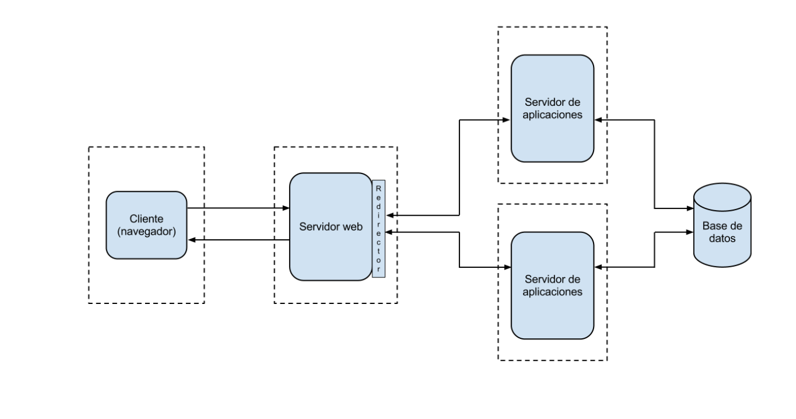

> NOTA: En cas d'estar utilitzant pàgines web estàtiques (no canvien en funció de diverses variables) no existiria la capa de dades, ja que aquestes van incorporades en els propis fitxers de marques que conformen les pàgines web.

La tendència és introduir dinamisme en diferents parts de l'esquema:

- Els navegadors web són capaços d'interpretar diferents elements interactius autònomament o mitjançant plugins (JavaScript, etc.).
- Els servidors web també poden interpretar codi (PHP, Python...) per generar les pàgines web. El servidor web necessita d'algun mòdul/extensió addicional per poder interpretar aquest codi. Generalment s'embebe en el propi servidor web per a llenguatges de script o s'incorpora en un servidor a part (d'aplicacions) per als llenguatges més potents. Alguns llenguatges que típicament s'utilitzen en les pàgines dinàmiques en el servidor web són PHP, Python, Ruby o Java. Aquests llenguatges també permeten l'accés a la capa de dades i la intercalació d'aquestes dades entre els elements de la pàgina final.

On s'execute el codi de dinamització de la pàgina determinarà si el llenguatge de programació és d'**entorn client** o d'**entorn servidor**.

## GENERACIÓ DE PÀGINES WEB

### Estàtiques

Una **pàgina web estàtica** és un document o conjunt de documents (generalment: HTML, CSS, contingut multimèdia, codi JavaScript) en què no existeix una **actualització dinàmica** del seu contingut en interactuar amb el sistema (servidor, ja siga remot o local) que proveeix el document/s. És a dir, la mateixa petició a la mateixa URL (Uniform Resource Locator), encara que la repetim en múltiples ocasions al llarg del temps, **sempre** tornarà la mateixa informació (a no ser que la modifique un desenvolupador en el costat servidor, manualment). Pot existir **interacció** amb la pàgina web estàtica (mitjançant codi JavaScript), en forma de missatges, esdeveniments, actualitzacions de la seua aparença...

En aquest cas, un navegador web és capaç de representar la pàgina web en una màquina local, sense necessitat de disposar d'un servidor web addicional.

### Dinàmiques

Una **pàgina web dinàmica** pot contenir una part estàtica, i a més el contingut que es mostre dependrà del moment en què es faça la petició. Això és degut a que el servidor conformarà aquest contingut depenent de les dades de què es dispose en aquell moment en un sistema de bases de dades. La comunicació entre el navegador web i el servidor serà més complexa, ja que, a més de consultar continguts, es podran realitzar potencialment operacions de creació, modificació, i eliminació de dades.

Una **aplicació web** és una eina de programari, formada per pàgines web dinàmiques (encara que també pot contenir documents web estàtics), basada en tecnologies web que li donen un caràcter *dinàmic* (interactuen amb un sistema remot) fent ús de serveis web (basats en l'arquitectura TCP/IP), i que proporcionen a l'usuari un servei o conjunt de serveis. Seria el més semblant a una aplicació nativa o d'escriptori, *però* executada en un navegador web. El fet d'executar-se en un navegador web les independitza del sistema operatiu en què s'executen, però també presenten determinades limitacions a causa d'aquesta independència.

En aquest cas, un navegador web **NO** és capaç de representar la pàgina web en una màquina local sense un servidor web addicional i la resta de components que acompanyen aquesta arquitectura, com sí era el cas d'una pàgina web estàtica.

## MODELS DE PROGRAMACIÓ

Quan parlem de programació en entorn client/servidor parlem també d'aplicacions web, formades per pàgines web dinàmiques, amb el que això implica una arquitectura web més complexa que la necessària per a un lloc web constituït únicament per pàgines web estàtiques.

Segons diferents autors, els models presentats en aquest document cauen sota la categoria d'arquitectures web. En el present document els considerarem models de programació, atenent a la forma en què estan organitzats i distribuïts els diferents fitxers que contenen la lògica de negoci de l'aplicació web.

Dit això, actualment trobem dos models de programació principals, que són els que es detallen a continuació.

### Model-Vista-Controlador

Model-View-Controller o Model-Vista-Controlador és un model de programació web que separa les dades i la lògica de negoci respecte a la interfície d'usuari, i el component encarregat de gestionar els esdeveniments i les comunicacions.

En separar els components en elements conceptuals permet reutilitzar el codi i millorar la seua organització i manteniment. Els seus elements són:

- **Model**: representa la informació i gestiona tots els accessos a aquesta, tant consultes com actualitzacions provinents, normalment, d'una base de dades. S'accedeix via el controlador.
- **Controlador**: Respon a les accions de l'usuari, i realitza peticions al model per sol·licitar informació. Després de rebre la resposta del model, li envia les dades a la vista.
- **Vista**: Presenta a l'usuari de forma visual el model i les dades preparades pel controlador. L'usuari interactua amb la vista i realitza noves peticions al controlador.

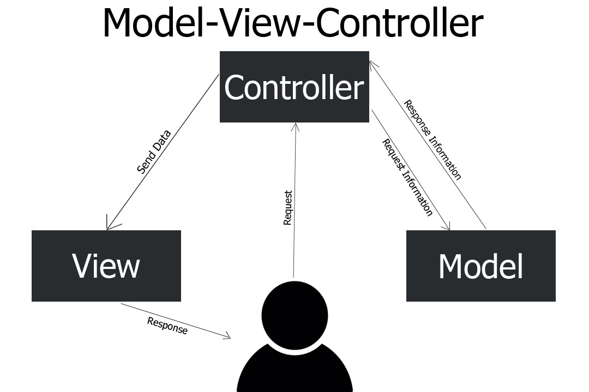{ width=50% style="display:block; margin:auto;" }

És molt important destacar que, en aquest model, és el servidor el que porta el pes principal tant del processat de la informació com de la seua representació. El client web, a grans trets, s'encarregarà d'enviar les peticions al servidor, rebre la resposta i representar-la en la pantalla de l'usuari. La pàgina web representada (codi HTML, JavaScript, etc.) s'haurà predeterminat en el costat servidor.

**IMPORTANT**: amb aquest model, cada petició del client al servidor implicarà un refresc de la informació que es visualitza en la pantalla, encara que la seua aparença haja canviat poc d'una petició a la següent. Això implica que es tornen a descarregar totes les dades i fitxers que no es mantinguen en la memòria cau del navegador, amb el que els temps de resposta seran majors que si no haguéssim de descarregar de nou determinada informació. L'usuari final apreciarà que, per un interval curt de temps, tots els elements de la pantalla desapareixen i després es conforma de nou la interfície d'usuari. En aquest cas, es diu que l'aplicació no és **reactiva** (es realitza un refresc de tota la pantalla, encara que no es necessite).

A aquest model de programació MVC s'ajustarà el primer projecte que realitzarem durant aquest curs, i la primera part del segon projecte.

Mitjançant aquest model s'han desenvolupat multitud de plataformes i aplicacions web, encara que la tendència és, cada vegada més, desenvolupar aplicacions basades en serveis REST.

### Aplicacions basades en serveis REST

En aquest tipus d'aplicacions, es delega la interacció amb l'usuari (si és que existeix), en aplicacions que es descarreguen i/o s'instal·len en el costat client (ja siga aplicacions d'escriptori, aplicacions mòbils, o aplicacions web). El servidor s'encarrega d'implementar la lògica de negoci, gestionar les dades, i enviar al client només la part de la informació sol·licitada, normalment en format [JSON](https://www.w3schools.com/js/js_json_intro.asp).

Un esquema de funcionament podria ser el següent:

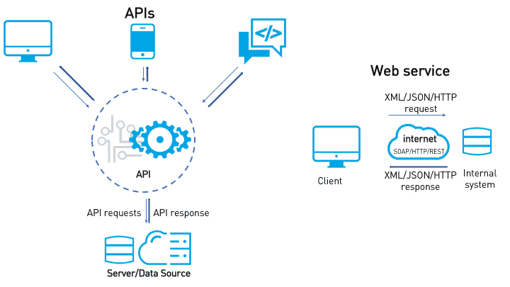{ style="display:block; margin:auto;" }

S'anomena API al conjunt de serveis web a través dels quals els clients interactuen amb el servidor. Cadascun d'aquests serveis web s'identifiquen per un endpoint (URL en el costat servidor), entre altres paràmetres. Aquests conceptes es revisaran amb més deteniment en la segona fase del segon projecte que es desenvoluparà durant el curs.

És important notar que, a diferència del model MVC, cada vegada que es faça una petició al servidor no es refrescarà la pàgina web per complet. L'arquitectura web permetrà que només s'actualitze una part de la interfície d'usuari, amb el que l'usuari final no experimentarà la desaparició de la interfície transitoriament.

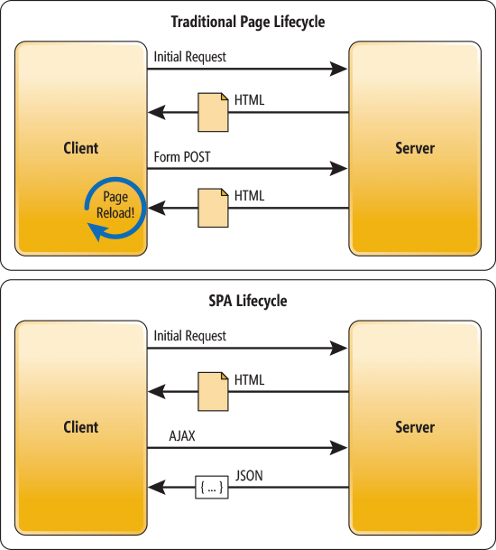{ style="display:block; margin:auto;" }

Aquest comportament s'assembla més a una aplicació web a una aplicació mòbil (**la idea general és que no instal·lem una app mòbil cada vegada que realitzem una acció, sinó que només s'instal·la una vegada**).

Un exemple d'aquest tipus d'aplicacions són les SPA (*Single Page Application*). En una SPA només existeix un fitxer HTML, molt simple, i un altre o altres fitxers JavaScript que s'encarreguen de canviar la interfície d'usuari amb cada petició HTTP al servidor. Per tant, l'aplicació es descarrega una sola vegada (es podria dir que s'"instal·la" en el navegador) i a partir d'ací només s'intercanvien fitxers JSON amb el servidor, que contenen les dades a gestionar pel client. D'aquesta manera, s'aligera la part visual del back-end, i cada client (ja siga una aplicació web, mòbil, d'escriptori...) tindrà la responsabilitat de representar-la en la pantalla segons les seues pròpies característiques.

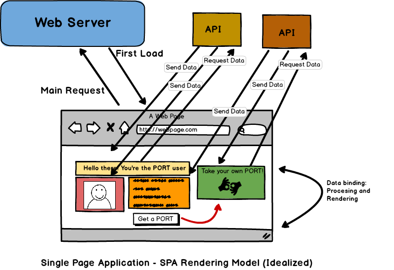{ style="display:block; margin:auto;" }

Cal destacar també que els sistemes que implementen serveis REST no només *alimenten* aplicacions client, sinó que també poden interactuar amb altres sistemes. Aquest podrà ser el cas d'aplicacions híbrides, que requereixen de serveis externs per realitzar determinades tasques (enviament de correus electrònics, serveis d'IA, etc).

## MECANISMES D'EXECUCIÓ DE CODI

Durant el primer curs del cicle haureu pogut desenvolupar diferents programes consistents en fitxers que al seu torn contenen línies de codi en un llenguatge específic (Java, en aquest cas). Què es necessita per poder transformar aquest text en instruccions específiques per al sistema operatiu on s'executa aquest codi? En aquest punt és on entra en joc el concepte d'*entorn d'execució*.

Els elements d'un entorn d'execució varien depenent del llenguatge de programació que s'estiga utilitzant. En general sempre és necessari un compilador, intèrpret o màquina virtual i un conjunt de llibreries pròpies del llenguatge. Però pot constar de més elements com un depurador o un bucle d'esdeveniments.

Dit això, quins són els mecanismes per a l'execució del codi en l'àmbit de les aplicacions web? Per contestar a això, primer hauríem de diferenciar els diferents llenguatges de programació que es poden utilitzar, i en quins àmbits (client o servidor). És per això que, en els següents subapartats, revisarem primer alguns dels llenguatges de programació més rellevants en l'àmbit web, i a continuació es detallarà com s'executen en el costat servidor (PHP, Python, i JavaScript) i en el client (JavaScript).

### Llenguatges de programació

S'enumeren a continuació els llenguatges de programació més populars, en els diferents entorns:

| ENTORN SERVIDOR | DESCRIPCIÓ |
|------------------|-------------|
| PHP | PHP és un llenguatge de programació d'ús general que s'adapta *especialment* al desenvolupament web. La seua última versió és PHP7. Aquest llenguatge es pot utilitzar sense cap tipus de framework per desenvolupar aplicacions web, encara que també existeixen frameworks molt populars com CodeIgniter, Laravel, Symfony... |
| Python | Python és un llenguatge d'alt nivell de programació interpretat la filosofia del qual és fer èmfasi en la llegibilitat del seu codi. Per a programació web existeixen diversos frameworks, encara que els més destacats són Django i Flask. Cal destacar que aquest llenguatge s'utilitza en multitud d'àmbits més, entre ells el de la ciberseguretat i el de la intel·ligència artificial. |
| JavaScript | JavaScript és un llenguatge de programació interpretat, dialecte de l'estàndard ECMAScript. Encara que va sorgir per al desenvolupament en entorn client, s'ha estès tant que han sorgit nombrosos frameworks en entorn servidor, sent Nodejs el més popular. |
| Ruby | Ruby és un llenguatge de programació interpretat i orientat a objectes. Ruby on Rails és el framework de programació web basat en Ruby més conegut. |
| Java | Java és un llenguatge de programació ràpid, segur i fiable per codificar tot, des d'aplicacions mòbils i programari empresarial fins a aplicacions de macro dades i tecnologies del costat del servidor. Com a frameworks web destaquen Spring i Hibernate. |

| ENTORN CLIENT | DESCRIPCIÓ |
|-----------------|-------------|
| JavaScript | És el llenguatge per excel·lència en el desenvolupament d'entorn client. Existeix un desenvolupament continu de frameworks i llibreries al voltant d'aquest llenguatge, ja no només en la programació client, sinó en el costat servidor (com s'ha vist anteriorment). Els principals frameworks per al desenvolupament d'aplicacions reactives basats en JavaScript són: React.js, Vue.js, Angular i Svelte. |
| TypeScript | TypeScript és un llenguatge de programació lliure i de codi obert desenvolupat i mantingut per Microsoft. És un superconjunt de JavaScript, que essencialment afegeix tipus estàtics i objectes basats en classes. Els principals frameworks de programació client reactius (mencionats anteriorment) suporten el desenvolupament tant en JavaScript com TypeScript. |
| Python | Encara que moltíssim menys popular, també existeix la possibilitat d'executar Python en el navegador, com s'il·lustra amb el projecte [PyScript](https://www.genbeta.com/actualidad/ano-python-navegador-este-nuevo-proyecto-permite-ejecutar-python-tu-html). |

Per tant, veiem que existeix gran varietat de llenguatges de programació, tant en client com servidor, i és un àmbit en contínua evolució.

Quin és el millor llenguatge de programació? Aquesta és l'eterna pregunta que escoltaràs al llarg de la teua carrera com a programador/a, i no hi ha una resposta fàcil. Potser la resposta més adequada siga la de: cadascun d'ells és bo per a una cosa, i el millor és tenir una mentalitat oberta, no lligar-se a cap d'ells, i tenir les bases de la programació clares.

Aquesta reflexió és de especial interès si desenvolupes els teus propis projectes: l'elecció d'un llenguatge (o framework) o altre et pot portar a l'èxit o fracàs, que un projecte et resulte rendible o no, optimització de costos o no... Per tant, mantingues una ment oberta i pensa que els llenguatges i tecnologies tenen caràcter passatger, estan per ser utilitzats i no per casar-se amb ells.

### Execució

La lògica de la nostra aplicació es distribueix entre el client i el servidor, cadascun d'ells compleix la seua funció específica. Així, la plataforma d'execució en aquests dos àmbits ha de ser diferent:

- Costat servidor: la lògica programada s'executa en el sistema operatiu en el qual resideix el codi.
- Costat client: la lògica s'executa en el navegador web.

A més de l'àmbit en què s'executa el codi, també cal particularitzar el mecanisme d'execució al llenguatge específic utilitzat (com s'ha esmentat en la discussió inicial d'aquest apartat, sobre l'"entorn d'execució").

A continuació es detalla com es dispara l'execució del codi programat, ja siga en el costat servidor davant una petició HTTP que prové del client web, o en el propi navegador web davant una acció de l'usuari.

Abans de veure aquests exemples, cal esmentar que el propòsit d'un servidor web és rebre peticions HTTP i enviar la resposta a aquestes peticions. És possible que aquestes respostes les proporcione el propi servidor web, o haja de recórrer a extensions (o mòduls) pròpies, o servidors d'aplicacions externs que executen el codi i retornen la resposta al servidor web (que la utilitzarà per enviar la resposta final al client). Tot això es detallarà exhaustivament en el mòdul de **Desplegament d'Aplicacions Web**.

En els següents exemples es pressuposa que l'entorn d'execució és el de *producció* (el que utilitzen els usuaris finals). En l'entorn de desenvolupament se solen emprar servidors web més lleugers que els propis frameworks de desenvolupament proporcionen.

#### PHP

Depenent del servidor web, aquest llenguatge es pot executar de les següents maneres:

- Apache:
    - Activació de mòdul intern (mod_php)
    - Mitjançant servidor d'aplicacions (phpFPM)

- Nginx: només existeix la possibilitat de delegar la tasca d'execució del codi a un servidor d'aplicacions, phpFPM en aquest cas.

#### Python

Igual que en el cas anterior, dependrà del servidor web que estiguem utilitzant:

- Apache:
    - Activació de mòdul intern (libapache2-mod-wsgi-py3, per a python3)
    - Mitjançant servidor d'aplicacions (gunicorn)

- Nginx: només existeix la possibilitat de delegar la tasca d'execució del codi a un servidor d'aplicacions (gunicorn).

#### JavaScript

Com s'ha esmentat anteriorment, aquest llenguatge, a dia d'avui, es pot executar tant en el costat client com en el costat servidor:

- En client (navegador web): els diferents navegadors actuals incorporen un entorn d'execució mitjançant el qual és possible executar codi JavaScript, no existeix comunicació directa amb el sistema operatiu. L'execució del codi sol respondre a les accions del usuari, i el navegador proporciona tots els recursos perquè es puga executar.
- En servidor: per poder executar codi JavaScript directament en un sistema operatiu, s'ha d'instal·lar prèviament l'entorn d'execució de Node.js. Aquest framework incorpora el seu propi servidor web per ser utilitzat en un servidor de producció, encara que és possible utilitzar Apache o Nginx com a [reverse proxy](https://www.cloudflare.com/es-es/learning/cdn/glossary/reverse-proxy/).

### Integració amb els llenguatges de marques

Durant el primer curs hem après sobre els llenguatges de marques (HTML, entre altres) i programació de propòsit general. Qüestions:

- Hi ha alguna relació entre aquests dos tipus de llenguatges?
- Per a què voldríem relacionar-los en una aplicació web?

Una possible resposta seria: cada tipus té un objectiu diferent, i la combinació d'ambdós ens proporciona la possibilitat de crear *pàgines web dinàmiques*.

Prenem com a exemple la següent pàgina web:

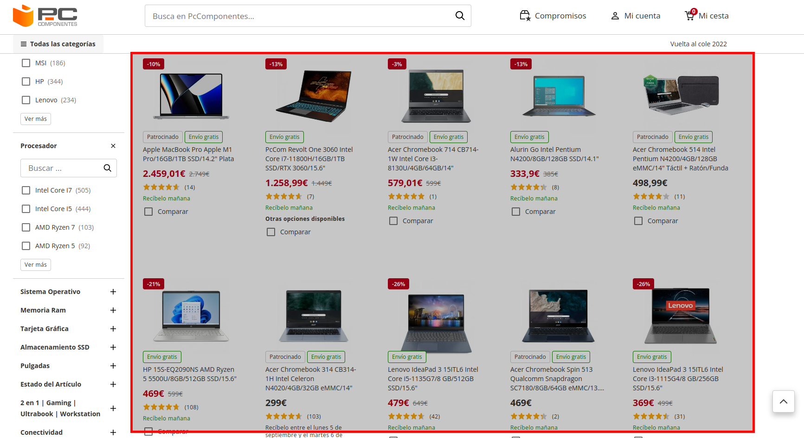
Cada un dels productes es visualitza en l'HTML segons el següent codi HTML:

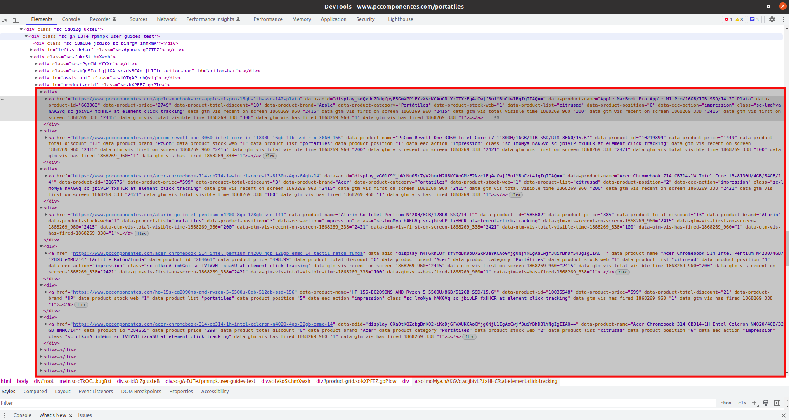

Creus que el programador web ha creat tants blocs 
 com productes s'han recuperat? Es pot saber a priori quants productes tornarà la cerca?

La resposta a les dues preguntes és: no. Per tant, la pàgina s'ha de comportar de manera dinàmica, en algun moment s'ha de programar la següent lògica: per cada producte a mostrar crea un bloc 
 amb aquestes característiques determinades, siga quin siga el nombre de productes a visualitzar en la pantalla.

És ací on entra la màgia del binomi "llenguatge de programació" + "llenguatge de marques", mitjançant el qual podrem afegir sentències d'un llenguatge de programació a codi HTML, aportant-li un caràcter dinàmic al document web.

Aquesta combinació es produirà en el costat servidor o en el costat client, depenent de si:

- És una aplicació web basada en **MVC** (Model-Vista-Controlador): la combinació dels dos llenguatges es durà a terme en el costat **servidor**. El llenguatge de programació serà l'emprat en el costat servidor (PHP o Python), i el document web serà enviat al costat client des del servidor.
- És una aplicació web basada en **serveis REST**: en aquest cas, la combinació dels dos llenguatges es durà a terme en el costat **client**. El llenguatge de programació serà l'emprat en el costat client, JavaScript en el nostre cas (també podria ser TypeScript). El client consumirà els serveis web del servidor i intercanviaran informació en format JSON. El client serà l'encarregat de modificar l'HTML de manera dinàmica.

Vegem un exemple amb una llista simple de productes, per al cas de MVC. En l'exemple de l'esquerra veiem que hem de crear tants blocs de productes com productes a representar; en l'exemple de la dreta, s'ha introduït un bucle mitjançant PHP que farà que, per cada producte de l'array de productes, es visualitze un bloc amb les seues dades corresponents:

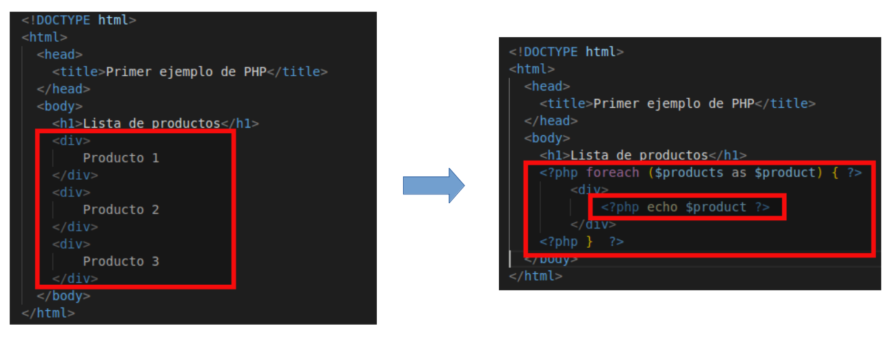
En aquest cas, veiem que s'ha introduït codi PHP amb un etiquetatge especial, que indica que aquest bloc del fitxer de marques conté codi PHP.

A continuació es mostra un altre exemple, en aquest cas d'integració d'un llenguatge de programació del costat client amb el llenguatge de marques HTML. Es tracta d'un component programat mitjançant el framework Vue.js:

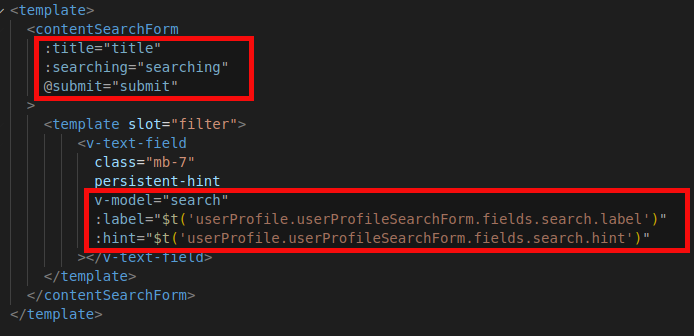{width=50% style="display:block; margin:auto;"}

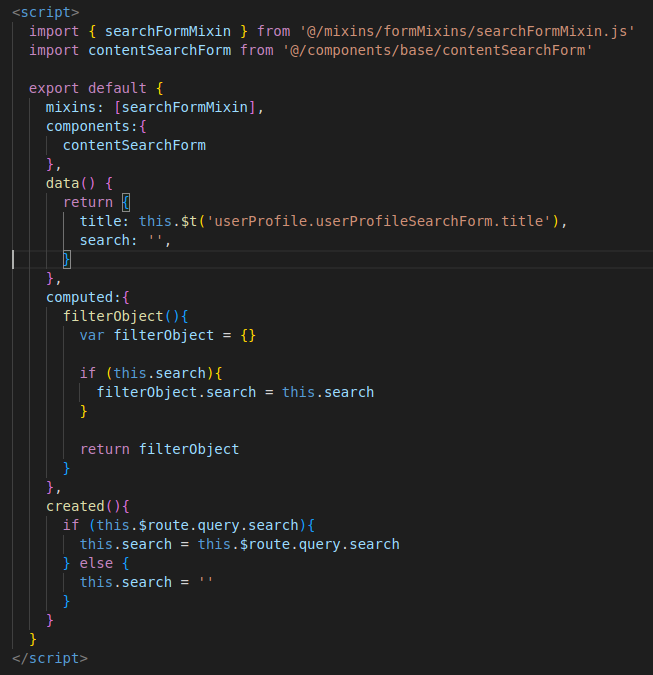{width=50% style="display:block; margin:auto;"}

En aquest cas també veiem que existeixen atributs amb símbols com ":" o "@" en l'etiquetatge que apunten a variables del codi JavaScript.

Aquests exemples només exemplifiquen la integració dels llenguatges de marques amb un llenguatge de programació, sense ànim d'aprofundir més en aquest moment del curs.

## EINES DE PROGRAMACIÓ (CLIENT I SERVIDOR). IDEs, EDITORS, COMPILADORS

L'ecosistema d'eines en l'entorn web és ampli, ric i en constant evolució. És per això que fer una llista exhaustiva es fa difícil, i pot quedar obsoleta en uns pocs mesos. En aquest [enllaç](https://kinsta.com/es/blog/herramientas-desarrollo-web/) es proposa una mostra d'aquestes eines.

Algunes d'aquestes eines et resultaran familiars, altres les utilitzaràs en la teua futura vida professional o no (depenent del camp en què t'especialitzes), i moltes altres seran substituïdes o deixaran de ser usades.

Durant aquest curs podràs utilitzar l'IDE o editor de text de la teua elecció. Visual Studio Code (per a qualsevol llenguatge de programació) o PyCharm (per a Python) són l'opció recomanada.

Com a fonts de consulta de problemes específics, [StackOverflow](https://stackoverflow.com/) és una de les plataformes més utilitzades.

Finalment, com a base per a llenguatges de programació i de marcatge, o com a repàs del primer curs del cicle, et pots recolzar en els manuals de [W3CSchools](https://www.w3schools.com/).

## TECNOLOGIES

Igual que en les eines de programació, l'ecosistema de tecnologies al voltant de les aplicacions web també és molt variat, ric, i en constant evolució. Continuament sorgeixen noves versions de les tecnologies existents (que trenquen amb les anteriors), o tecnologies/frameworks/llibreries novedoses als quals s'adhereixen multitud de professionals. Tot això fa que la corba d'aprenentatge inicial en l'àmbit de les aplicacions web siga més acusada en un principi.

A continuació es presenten algunes d'aquestes tecnologies, agrupades per tipologia.

### Virtualització

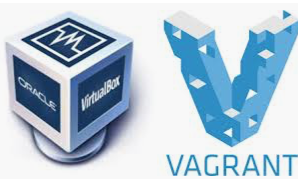{width=25%} 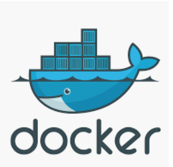{width=25%} 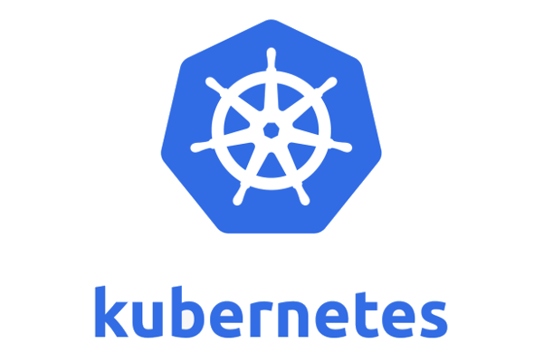{width=25%}

### Servidors web

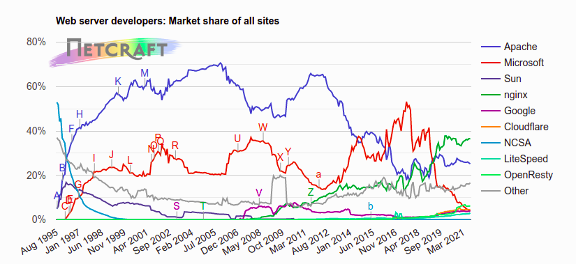{width=50%}

### Servidors d'aplicacions

{width=25%} 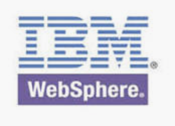{width=25%} {width=25%} {width=25%} 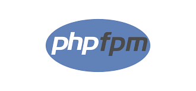{width=25%}

### Contenidors servlets
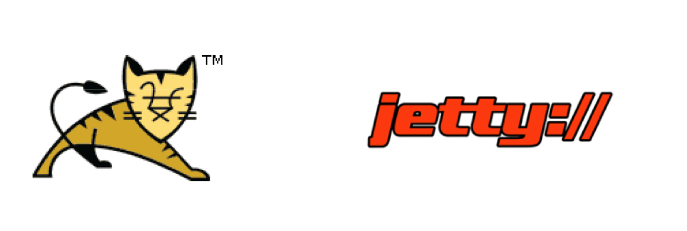{width=25%}

### Gestors de BBDD

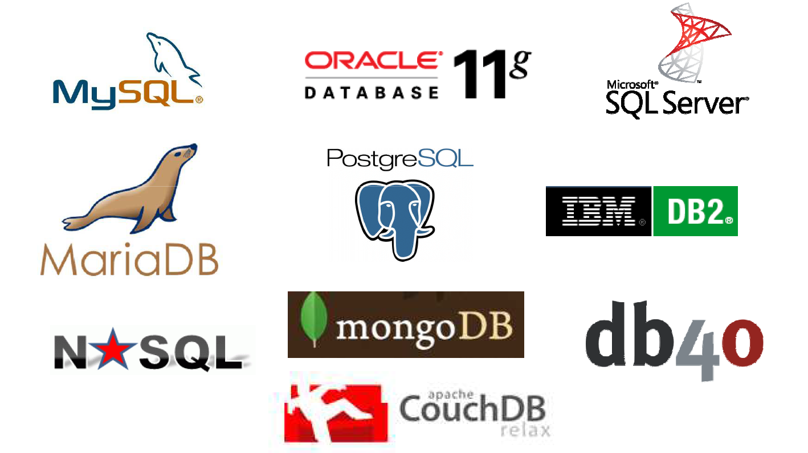

### Frameworks servidor

[Frameworks](https://www.youtube.com/watch?v=-RTaFJAgWSU) backend més populars.

### Frameworks client

[Frameworks](https://www.monocubed.com/best-front-end-frameworks/) frontend més populars.

## NAVEGADORS. TIPUS I CARACTERÍSTIQUES

Atès que l'entorn d'execució en el costat client és el navegador web, s'ha dedicat un apartat exclusivament per caracteritzar aquest tipus de programari.

Els navegadors representen un programari complex, en constant evolució, i en què les diferents opcions del mercat estan recolzades per motivacions diverses (darrere d'alguns existeix una empresa multinacional, altres estan recolzats per una comunitat de desenvolupadors, etc.), així com diferents principis de desenvolupament.

En la següent taula es resumeixen algunes de les característiques que diferencien diferents navegadors:

| Criteri         | Comparativa |
|------------------|-------------|
| Etiquetatge HTML  | [HTML Reference - Browser Support](https://www.w3schools.com/tags/ref_html_browsersupport.asp) |
| Etiquetatge CSS   | [CSS Browser Support Reference](https://www.w3schools.com/cssref/css3_browsersupport.asp) |
| Rendiment      | [Browser performance](https://www.webfx.com/blog/web-design/browser-performance/) |
| Velocitat        | [The Fastest Browser Options in 2022](https://www.cloudwards.net/fastest-browser/) |
| Seguretat        | [Navegadors segurs: comparativa de Chrome, Firefox, Edge i altres](https://www.ionos.es/digitalguide/online-marketing/vender-en-internet/comparativa-de-navegadores-seguros/) |

## ESPECIFICACIONS OFICIALS

Donada la gran quantitat de tecnologies i navegadors utilitzats en el costat client, existeix la voluntat d'estandarditzar determinats aspectes que governen aquestes tecnologies, en forma d'especificacions emeses per organismes reconeguts com a oficials. Es tracta que els diferents desenvolupadors tinguen suficient llibertat per ser competitius, però sense que el panorama es disperse excessivament.

A continuació es citen diversos d'aquests estàndards:

- [HTML5](https://html.spec.whatwg.org/multipage/): del W3C (Consorci de la World Wide Web)
- [CSS](https://www.w3.org/TR/CSS2/): també del W3C
- [ECMAScript](https://www.ecma-international.org/publications-and-standards/standards/ecma-262/): aplicat a JavaScript, i desenvolupat per ECMA International (organització internacional basada en membresies d'estàndards per a la comunicació i la informació)

En aquest [article](https://developer.mozilla.org/es/docs/Learn/Getting_started_with_the_web/The_web_and_web_standards) es discuteix la necessitat dels estàndards web, com a visió general.

## PROTOCOL HTTP

En el mòdul de Desplegament d'aplicacions web trobaràs els fonaments d'aquest protocol, base per a la comunicació entre client i servidor.

