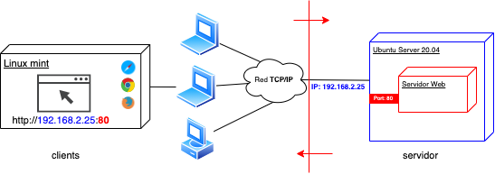

# UD1 - ARQUITECTURAS Y TECNOLOGÍAS WEB

{ width=50% style="display:block; margin:auto;" }

## SONDEO INICIAL

-   ¿Qué es Internet?
-   ¿Qué es la pila de protocolos TCP/IP?
-   ¿Qué protocolo de nivel de aplicación se utiliza en Internet? ¿cuál
    es la versión segura de este protocolo?
-   ¿Qué es una dirección IP? ¿qué es un puerto IP?
-   ¿Cuántas versiones del protocolo IP conoces?
-   ¿Qué es una URL? ¿mediante qué protocolo/servicio se relaciona un
    dominio con una dirección IP?
-   ¿Qué es una página web? ¿qué es una aplicación web? ¿qué es un sitio
    web? ¿qué es una arquitectura web?
-   ¿Cuál es la diferencia entre una página web estática y una dinámica?
    Las páginas web que has desarrollado durante el primer curso, ¿eran
    estáticas o dinámicas?
-   ¿Cuál es la diferencia entre la web 1.0 y la web 2.0?
-   Un navegador web, ¿qué es exactamente? ¿cuál es su función? ¿cuántos
    conoces? ¿existen diferencias entre ellos?
-   ¿Cuál crees que es la principal diferencia entre una aplicación web
    y una aplicación nativa? ¿has escuchado hablar de las aplicaciones
    híbridas? ¿conoces ejemplos de aplicaciones que tengan una versión
    web y su correspondiente nativa (app móvil)?
-   ¿Conoces los términos "back-end" y "front-end"? ¿cuál
    corresponde al desarrollo servidor y cuál al desarrollo en cliente?
    ¿qué ideas te inspira la imagen de la portada de este documento?
-   ¿Conoces los términos "back-office" y "front-office"? ¿cuál es
    la diferencia?

## EVALUACIÓN

El presente documento, junto con sus correspondiente boletín de
actividades (publicado adicionalmente), cubren los siguientes criterios
de evaluación:

PARTE SERVIDOR

| RESULTADOS DE APRENDIZAJE | CRITERIOS DE EVALUACIÓN |
|---------------------------|-------------------------|
| **RA1**. Selecciona las arquitecturas y tecnologías de programación web en entorno servidor, analizando sus capacidades y características propias. | a) Se han caracterizado y diferenciado los modelos de ejecución de código en el servidor y en el cliente web. b) Se han reconocido las ventajas que proporciona la generación dinámica de páginas. c) Se han identificado los mecanismos de ejecución de código en los servidores web. d) Se han reconocido las funcionalidades que aportan los servidores de aplicaciones y su integración con los servidores web. e) Se han identificado y caracterizado los principales lenguajes y tecnologías relacionados con la programación web en entorno servidor. f) Se han verificado los mecanismos de integración de los lenguajes de marcas con los lenguajes de programación en entorno servidor. g) Se han reconocido y evaluado las herramientas y frameworks de programación en entorno servidor. |

PARTE CLIENTE

| RESULTADOS DE APRENDIZAJE | CRITERIOS DE EVALUACIÓN |
|---------------------------|-------------------------|
| **RA1**. Selecciona las arquitecturas y tecnologías de programación sobre clientes web, identificando y analizando las capacidades y características de cada una. | a) Se han caracterizado y diferenciado los modelos de ejecución de código en el servidor y en el cliente web. b) Se han identificado las capacidades y mecanismos de ejecución de código de los navegadores web. c) Se han identificado y caracterizado los principales lenguajes relacionados con la programación de clientes web. d) Se han reconocido las particularidades de la programación de guiones y sus ventajas y desventajas sobre la programación tradicional. e) Se han verificado los mecanismos de integración de los lenguajes de marcas con los lenguajes de programación de clientes web. f) Se han reconocido y evaluado las herramientas de programación y prueba sobre clientes web. |

## ARQUITECTURAS WEB

Las arquitecturas web describen la relación entre los distintos
elementos que participan en el intercambio/procesamiento de información
a través de Internet, así como sus funciones.

La gran mayoría de las arquitecturas web en la actualidad son de tipo
**cliente-servidor:** una comunicación asimétrica en la que uno de los
extremos ofrece uno o más servicios y el otro hace uso de ellos. Ésta es
la arquitectura sobre la que nos centraremos, aunque existen otras como
la [Punto a Punto (P2P - Peer to
Peer)](https://es.wikipedia.org/wiki/Peer-to-peer).

### **Arquitectura** Cliente-Servidor

El modelo cliente-servidor es un modelo que reparte tareas entre los
proveedores de un recurso o servicio, llamados **servidores**, y los
solicitantes/consumidores del servicio, llamados **clientes**.

Lo más frecuente es que los clientes y los servidores se comuniquen a
través de una red de comunicaciones, pero ambos pueden residir en la
misma máquina (normalmente en tareas de desarrollo).

El esquema de funcionamiento más básico del modelo cliente-servidor para
una arquitectura web está basado en uno o varios clientes que solicitan
una página web a un servidor web:

1.  Desde el navegador web (o agente de usuario, que puede ser también
    una app nativa u otro servidor incluso) el usuario solicita un
    servicio web indicando su URL.
2.  El servidor recibe la **petición** mediante el protocolo de
    aplicación HTTP, y la procesa mediante su **lógica de negocio**.
3.  Produce una **respuesta** HTTP a la petición, que envía al cliente.
    Esta respuesta puede contener **ficheros** de distinta naturaleza:
    HTML, CSS, XML, JSON, ficheros multimedia, código JavaScript, etc.
4.  El navegador web recibe la información enviada por el servidor y la
    interpreta. En función de la respuesta enviada, se respresenta en el
    navegador la respuesta al usuario (normalmente en forma de página
    web).

A continuación se muestran las ventajas y desventajas al respecto:

Ventajas:

-   **Centralización** del control: los accesos, recursos y la
    integridad de los datos son controlados por el servidor. Esta
    centralización también facilita la tarea de actualizar datos u otros
    recursos.
-   **Escalabilidad**: se puede aumentar la capacidad de clientes y
    servidores por separado. Cualquier elemento puede ser aumentado (o
    mejorado) en cualquier momento, o se pueden añadir nuevos nodos a la
    red (clientes y/o servidores), siempre que el sistema esté diseñado
    para ello.
-   **Portabilidad**: el hecho de que la aplicación web se ejecute en un
    navegador web, hace que se independice el software del sistema
    operativo sobre el que se ejecuta. De esta forma, se aprovecha el
    desarrollo para las diferentes plataformas.
-   Fácil **mantenimiento**: al estar distribuidas las funciones y
    responsabilidades entre varios ordenadores independientes, es
    posible reemplazar, reparar, actualizar, o incluso trasladar un
    servidor, mientras que sus clientes no se verán afectados por ese
    cambio (o se afectarán mínimamente). Esta independencia de los
    cambios también se conoce como **encapsulación**.
-   Existen **tecnologías**, suficientemente desarrolladas, diseñadas
    para el modelo de cliente-servidor que aseguran la seguridad en las
    transacciones, la **usabilidad** de la interfaz, y la facilidad de
    uso.

Desventajas:

-   La **congestión** del tráfico ha sido siempre un problema en esta
    arquitectura. Cuando una gran cantidad de clientes envían peticiones
    simultáneas al mismo servidor, se pueden producir situaciones de
    sobrecarga.
-   Cuando un servidor está caído, las peticiones de los clientes **no
    pueden ser satisfechas**, ya que los recursos no están distribuidos.
-   El software y el hardware de un servidor son generalmente muy
    determinantes. Normalmente se necesita **software y hardware
    específico**, dependiendo del tipo de servicio web, sobre todo en el
    lado del servidor. Esto aumentará el coste. Como alternativa, se
    dispone de servicios web en la nube, con diversos tipos de costes
    dependientes de la arquitectura web.

*NOTA*: estas desventajas se refieren al caso en que los recursos del
servidor no están replicados y/o distribuidos. Actualmente existen
técnicas de escalado horizontal y vertical que pueden subsanar estos
problemas.

### Peticiones desde el navegador: ejemplo práctico

En este apartado vamos a tratar de indagar un poco más en qué sucede
detrás de las cortinas cuando consultamos una URL. Vamos a observar, a
través de las herramientas de desarrollador del navegador web de Chrome
(igual nos puede servir Firefox o cualquier otro), los 4 pasos que se
detallaban en el apartado anterior.

Para ello vamos a utilizar la página web del ayuntamiento de Elche
(www.elche.es).

1.  Abrimos una pestaña del navegador web e introducimos la URL
    www.elche.es.

A continuación abrimos las herramientas de desarrollador y vamos a la pestaña Network (o Red):

En estos momentos aún no hay datos, porque no hemos hecho una petición al servidor con la ventana de herramientas de desarrollador activa. Por tanto, refrescamos la página (equivalente a hacer una petición al servidor que gestiona www.elche.es) y pasamos al punto siguiente.

2.  El servidor recibe la petición mediante el protocolo de aplicación HTTP, y la procesa mediante su lógica de negocio.

Realmente no podemos saber exactamente qué está sucediendo en el servidor durante este paso, a no ser que tuviésemos acceso al mismo, con los privilegios y herramientas correctas, pero sí podemos averiguar muchos datos mediante herramientas como:

-   [whois](https://who.is/dns/elche.es): nos indica, entre otros datos, que la IP del servidor es 217.13.88.8 (registro DNS de tipo A).
- [builtwith](https://builtwith.com/detailed/elche.es): nos indica, entre otras cosas, que la plataforma web dispone de dos servidores web (Apache y nginx).

**OJO**: Existe otro tipo de métodos para conocer más datos sobre el servidor podría implicar prácticas ilegales, en el ámbito de la ciberseguridad.

Este paso se llevaría a cabo en lo que se denomina **Back-end**.

Vamos a ver el resultado en el siguiente paso.

1.  El servidor produce una respuesta a la petición del cliente, que la
    envía a través de internet y recupera nuestro navegador.

Ahora, si consultamos la pestaña Network después de refrescar la URL, podremos ver que han aparecido muchos registros, el primero de los cuales tiene como nombre \"www.elche.es\":

Este registro corresponde a la primera petición que hemos realizado al servidor de www.elche.es. Si pinchamos sobre él podremos ver tanto los datos de la petición realizada, como la respuesta enviada por el servidor a través de Internet, mediante HTTP. Se puede ver que el código devuelto por el servidor es 200 (en color verde, signo de que no ha habido error), y ha respondido un servidor web nginx:

> *NOTA*: el servidor puede enviar también su versión software, pero esto podría conllevar ataques maliciosos, 
> dependiendo de las vulnerabilidades de dicha > versión. Es por ello que es una buena práctica configurar el servidor web 
> para que no envíe dicha versión (entre otros aspectos).

Más abajo, en la misma respuesta, nos indica los parámetros con que se ha realizado la petición. Entre éstos, podemos ver el tipo de petición que hemos hecho (GET), la versión de nuestro navegador web, el lenguaje en que queremos recibir la información, entre otros detalles:

La petición ha tardado (en la prueba actual) 6.31 segundos en resolverse, y ha desembocado en una transferencia por parte del servidor de un total de 136 respuestas y 57.9 kB transferidos (entre otras métricas):

El resto de registros que están debajo del inicial, se corresponden con todos los recursos (ficheros HTML, JavaScript, archivos multimedia, etc.) necesarios para que el navegador represente la página web. Por ejemplo, si pinchamos sobre el segundo registro "polyfiller.js", y pinchamos sobre la pestaña "Preview" del panel
de la derecha, podremos ver el código JavaScript que contiene este fichero transferido:

"Logo-ayto-elche-nuevo.png" podremos ver que es el logo del ayuntamiento, transferido desde el servidor:

Todos estos ficheros tardan un tiempo en transferirse, lo que se representa en forma de waterfall (cascada):

La petición que más tarda en resolverse es la primera, según este gráfico.

¿Te recuerda esto a algún tipo de programa de descargas tipo BitTorrent o similares? Pues sí, en este caso se podría pensar en el navegador web como si de un gestor de descargas se tratase (salvando las diferencias), que se encarga de recuperar todos los ficheros que necesita para representar la página web que se le ha solicitado.

2.  El navegador web recibe la información enviada por el servidor y la
    interpreta. En función de la respuesta enviada, se respresenta en el
    navegador la respuesta al usuario (normalmente en forma de página
    web).

El navegador web es un software diseñado para interpretar todo el
contenido enviado por un servidor web, y representarlo en la pantalla
para que el usuario final pueda consultar la información recibida,
interaccionar con la página web, o también gestionar las operaciones
del usuario que requieran nuevas peticiones al servidor web (en caso
de páginas web dinámicas, o aplicaciones web).

Por ello, el navegador web tomará todos los ficheros descargados y
conformará la página de bienvenida de www.elche.es, lo que se denomina
**Front-end**:

¿Aún continúas pensando que es correcto decir "navegar por Internet"?

### Modelo actual de Arquitectura web

El modelo actual de arquitectura web es un tipo concreto de la
arquitectura cliente-servidor, en la cual los componentes y los recursos
de una aplicación se separan según los siguientes niveles:

1\. Una **capa cliente**: es generalmente el navegador Web ejecutándose
en el dispositivo del usuario final, aunque también se puede tratar de
aplicaciones nativas, de escritorio u otros sistemas, que requieran
respuestas en forma de ficheros de texto plano con lenguajes de marcas
(XML, JSON).

2\. Un servidor Web y/o servidor de aplicaciones (**capa de negocio**):
La capa cliente puede acceder a diferente lógica y procedimientos que
existen en la capa de negocio. Aquí la lógica puede ser mucho más
compleja que en la capa anterior. Los componentes de esta capa pueden
ser desde simples archivos HTML, Servlets de Java, ficheros PHP, Python,
etc.

3\. Una **capa de datos**: Se compone de un sistema de almacenamiento y
acceso a datos que se utilizan para confeccionar la respuesta que se
envía de vuelta al cliente. Generalmente es un gestor o gestores de
bases de datos (relacionales o no relacionales) pero pueden ser ficheros
de texto plano, ficheros XML, JSON, etc.

La capa de negocio puede estar a su vez dividida en dos partes si el
sistema es suficientemente grande o complejo. Puede dividirse en una
capa de presentación y una capa de lógica de negocio.

-   La **capa de presentación **se encarga de componer las páginas
    integrando la parte dinámica en la estática. Además también procesa
    las páginas que envía el cliente (por ejemplo datos en formularios).
    Esta parte la realiza generalmente un **servidor web.**

-   La **capa de lógica de negocio **lleva a cabo operaciones más
    complejas. Se corresponde con la implantación de un **servidor de
    aplicaciones**. Realiza muchos tipos de operaciones entre los que
    destacan:

    -   Realizar todas las operaciones y validaciones.
    -   Gestionar el flujo de trabajo (workflow) incluyendo el control y
        gestión de las sesiones y los datos que se necesitan.
    -   Gestionar todas las operaciones de accesos a datos desde la capa
        de presentación.

> NOTA: En el caso de estar usando páginas web estáticas
> (no cambian en función de diversas variables) no existiría la capa de
> datos ya que estos van incorporados en los propios archivos de marcas
> que serán las que conforman las páginas web.

La tendencia es introducir dinamismo en diferentes partes del esquema:

-   Los navegadores Web son capaces de interpretar diferentes elementos
    interactivos autónomamente o mediante plugins (javascript, etc.)
-   Los servidores Web también pueden interpretar código (PHP,
    Python\...) para generar las páginas web. El servidor web necesita
    de algún módulo/extensión adicional para poder interpretar este
    código. Generalmente se embebe en el propio servidor web para
    lenguajes de script o se incorpora en un servidor a parte (de
    aplicaciones) para los lenguajes más potentes. Algunos lenguajes que
    típicamente se usan en las páginas dinámicas en el servidor web son
    PHP, Python, Ruby o Java. Estos lenguajes también permiten el acceso
    a la capa de datos y la intercalación de estos datos entre los
    elementos de la página final.

Donde se ejecute el código de dinamización de la página determinará si
el lenguaje de programación es de **entorno cliente** o de **entorno servidor**.

### Estructura y recursos de una aplicación web. Modelo simple.

Una plataforma web es el conjunto de elementos software, utilizados para
desarrollar y poner en funcionamiento una aplicación web. En términos
generales, consta de cuatro componentes básicos:

1.  El **sistema operativo**, bajo el cual opera el equipo donde se
    hospedan las páginas web y que representa la base misma del
    funcionamiento del computador. En ocasiones limita la elección de
    otros componentes.
2.  El **servidor web** es el software que escucha y maneja las
    peticiones desde equipos remotos a través de internet, mediante el
    protocolo HTTP. En el caso de páginas estáticas, el servidor web
    simplemente provee el archivo solicitado, el cual se interpreta en
    el navegador. En el caso de sitios dinámicos, el servidor web se
    encarga de pasar las solicitudes a otros programas (servidor de
    aplicaciones) que puedan gestionarlas adecuadamente. En la
    actualidad los servidores web más populares son Apache y Nginx.
    Existen muchos otros servidores web. En el siguiente enlace se puede
    consultar una lista de servidores web:

[https://en.wikipedia.org/wiki/Comparison_of_web_server_software
](https://en.wikipedia.org/wiki/Comparison_of_web_server_software)

3.  El **gestor de bases de datos** se encarga de almacenar
    sistemáticamente un conjunto de registros de datos relacionados para
    ser usados posteriormente.
4.  Un **lenguaje de programación** que controla las aplicaciones de
    software que se ejecutan en el sitio web.

Un esquema básico sería el siguiente:

Diferentes combinaciones de los cuatro componentes señalados, basadas en
las distintas opciones de software disponibles en el mercado, dan lugar
a numerosas plataformas web, aunque, sin duda, hay dos que sobresalen
del resto por su popularidad y difusión: LAMP y WISA.

La plataforma LAMP trabaja enteramente con componentes de software libre
y no está sujeta a restricciones propietarias. El nombre LAMP surge de
las iniciales de los componentes de software que la integran:

-   Linux: Sistema operativo.
-   Apache: Servidor web, aunque últimamente el servidor Nginx está
    ganando en popularidad.
-   MySQL: Gestor de bases de datos.
-   PHP: Lenguaje interpretado PHP, aunque a veces se sustituye por Perl
    o Python.

La plataforma WISA está basada en tecnologías desarrolladas por la
compañía Microsoft; se trata, por lo tanto, de software propietario. La
componen los siguientes elementos:

-   Windows: Sistema operativo.
-   Internet Information Services: servidor web.
-   SQL Server: gestor de bases de datos.
-   ASP o ASP.NET: como lenguaje para scripting del lado del servidor.

Existen otras plataformas, como por ejemplo la configuración
Windows-Apache-MySQL-PHP que se conoce como WAMP. Es bastante común pero
solo como plataforma de desarrollo local.

De forma similar, un servidor Windows puede correr con MySQL y PHP. A
esta configuración se la conoce como plataforma WIMP.

Existen muchas otras plataformas que trabajan con distintos sistemas
operativos (Unix, MacOS, Solaris), servidores web (incluyendo algunos
que se han cobrado relativa popularidad como Lighttpd y LiteSpeed),
bases de datos (PostgreSQL) y lenguajes de programación.

## GENERACIÓN DE PÁGINAS WEB

### Estáticas

Una **página web estática** es un documento o conjunto de documentos
(generalmente: HTML, CSS, contenido multimedia, código JavaScript) en el
que no existe una **actualización dinámica** de su contenido al
interactuar con el sistema (servidor, ya sea remoto o local) que provee
el documento/s. Es decir, la misma petición a la misma URL (Uniform
Resource Locator), aunque la repitamos en múltiples ocasiones a lo largo
del tiempo, **siempre** va a devolver la misma información (a no ser que
la modifique un desarrollador en el lado servidor, manualmente). Puede
existir **interacción** con la página web estática (mediante código
JavaScript), en forma de mensajes, eventos, actualizaciones de su
apariencia\...

En este caso, un navegador web es capaz de representar la página web en
una máquina local, sin necesidad de disponer de un servidor web
adicional.

### Dinámicas

Una **página web dinámica** puede contener una parte estática, y además
el contenido que se muestre dependerá del momento en el cual se realice
la petición. Esto es debido a que el servidor conformará dicho contenido
dependiendo de los datos de que se disponga en ese momento en un sistema
de bases de datos. La comunicación entre el navegador web y el servidor
será más compleja, ya que, además de consultar contenidos, se podrán
realizar potencialmente operaciones de creación, modificación, y
eliminación de datos.

Una **aplicación Web** es una herramienta software, formada por páginas
web dinámicas (aunque también puede contener documentos web estáticos),
basada en tecnologías web que la dotan de un carácter *dinámico*
(interactúan con un sistema remoto) haciendo uso de servicios web
(basados en la arquitectura TCP/IP), y que proporcionan al usuario un
servicio o conjunto de servicios. Sería lo más parecido a una aplicación
nativa o de escritorio, *pero* ejecutada en un navegador web. El hecho
de ejecutarse en un navegador web las independiza del sistema operativo
en el que se ejecutan, pero también presentan determinadas limitaciones
debido a esta independencia.

En este caso, un navegador web **NO** es capaz de representar la página
web en una máquina local sin un servidor web adicional y el resto de
componentes que acompañan a esta arquitectura, como sí era el caso de
una página web estática.

## MODELOS DE PROGRAMACIÓN

Cuando hablamos de programación en entorno cliente/servidor hablamos
también de aplicaciones web, formadas por páginas web dinámicas, con lo
que esto implica una arquitectura web más compleja que la necesaria para
un sitio web constituido únicamente por páginas web estáticas.

Según diferentes autores, los modelos presentados en este documento caen
bajo la categoría de arquitecturas web. En el presente documento los
consideraremos modelos de programación, atendiendo a la forma en que
están organizados y distribuidos los diferentes ficheros que contienen
la lógica de negocio de la aplicación web.

Dicho esto, actualmente encontramos dos modelos de programación
principales, que son los que se detallan a continuación.

###  Modelo-Vista-Controlador

Model-View-Controller o Modelo-Vista-Controlador es un modelo de
programación web que separa los datos y la lógica de negocio respecto a
la interfaz de usuario, y el componente encargado de gestionar los
eventos y las comunicaciones.

Al separar los componentes en elementos conceptuales permite reutilizar
el código y mejorar su organización y mantenimiento. Sus elementos son:

-   **Modelo**: representa la información y gestiona todos los accesos a
    ésta, tanto consultas como actualizaciones provenientes,
    normalmente, de una base de datos. Se accede via el controlador.
-   **Controlador**: Responde a las acciones del usuario, y realiza
    peticiones al modelo para solicitar información. Tras recibir la
    respuesta del modelo, le envía los datos a la vista.
-   **Vista**: Presenta al usuario de forma visual el modelo y los datos
    preparados por el controlador. El usuario interactura con la vista y
    realiza nuevas peticiones al controlador.

{ width=50% style="display:block; margin:auto;" }

Es muy importante destacar que, en este modelo, es el servidor el que
lleva el peso principal tanto del procesado de la información como de su
representación. El cliente web, a grosso modo, se dedicará a enviar las
peticiones al servidor, recibir la respuesta y representarla en la
pantalla del usuario. La página web representada (código HTML,
JavaScript, etc.) se habrá predeterminado en el lado servidor.

**IMPORTANTE**: con este modelo, cada petición del cliente al servidor
implicará un refresco de la información que se visualiza en la pantalla,
aunque su apariencia haya cambiado poco de una petición a la siguiente.
Esto implica que se vuelvan a descargar todos los datos y ficheros que
no se mantengan en la caché del navegador, con lo que los tiempos de
respuesta serán mayores que si no tuviésemos que descargar de nuevo
determinada información. El usuario final apreciará que, por un
intervalo corto de tiempo, todos los elementos de la pantalla
desaparecen y después se conforma de nuevo la interfaz de usuario. En
este caso, se dice que la aplicación no es **reactiva** (se realiza un
refresco de toda la pantalla, aunque no se necesite).

A este modelo de programación MVC se ajustará el primer proyecto que
realizaremos durante este curso, y la primera parte del segundo
proyecto.

Mediante este modelo se han desarrollado multitud de plataformas y
aplicaciones web, aunque la tendencia es, cada vez más, desarrollar
aplicaciones basadas en servicios REST.

### Aplicaciones basadas en servicios REST

En este tipo de aplicaciones, se delega la interacción con el usuario
(si es que existe), en aplicaciones que se descargan y/o instalan en el
lado cliente (ya sea aplicaciones de escritorio, aplicaciones móviles, o
aplicaciones web). El servidor se encarga de implementar la lógica de
negocio, gestionar los datos, y enviar al cliente solo la parte de la
información solicitada, normalmente en formato
[JSON](https://www.w3schools.com/js/js_json_intro.asp).

Un esquema de funcionamiento podría ser el siguiente:

{ style="display:block; margin:auto;" }

Se llama API al conjunto de servicios web a través de los cuales los
clientes interactúan con el servidor. Cada uno de estos servicios web se
identifican por un endpoint (URL en el lado servidor), entre otros
parámetros. Estos conceptos se revisarán con más detenimiento en la
segunda fase del segundo proyecto que se desarrollará durante el curso.

Es importante notar que, a diferencia del modelo MVC, cada vez que se
realice una petición al servidor no se refrescará la página web por
completo. La arquitectura web pemitirá que solo se actualice una parte
de la interfaz de usuario, con lo que el usuario final no experimentará
la desaparición de la interfaz transitoriamente.

{ style="display:block; margin:auto;" }

Este comportamiento asemeja más una aplicación web a una aplicación
móvil (**la idea general es que no instalamos una app móvil cada vez que
realizamos una acción, sino que solo se instala una vez**).

Un ejemplo de este tipo de aplicaciones son las SPA (*Single Page
Application*). En una SPA solo existe un fichero HTML, muy simple, y
otro u otros ficheros JavaScript que se encargan de cambiar la interfaz
de usuario con cada petición HTTP al servidor. Por tanto, la aplicación
se descarga una sola vez (se podría decir que se \"instala\" en el
navegador) y a partir de ahí solo se intercambian ficheros JSON con el
servidor, que contienen los datos a manejar por el cliente. De esta
forma, se aligera la parte visual del back-end, y cada cliente (ya sea
una aplicación web, móvil, de escritorio\...) tendrá la responsabilidad
de representarla en la pantalla según sus propias características.

{ style="display:block; margin:auto;" }

Es de destacar también que los sistemas que implementan servicios REST
no solo *alimentan* aplicaciones cliente, sino que también pueden
interactuar con otros sistemas. Éste podrá ser el caso de aplicaciones
híbridas, que requieren de servicios externos para realizar determinadas
tareas (envío de e-mails, servicios de IA, etc).

## MECANISMOS DE EJECUCIÓN DE CÓDIGO

Durante el primer curso del ciclo habréis podido desarrollar diferentes
programas consistentes en ficheros que a su vez contienen líneas de
código en un lenguaje específico (Java, en este caso). ¿Qué se necesita
para poder transformar este texto en instrucciones específicas para el
sistema operativo donde se ejecuta dicho código? En este punto es donde
entra en juego el concepto de *entorno de ejecución*.

Los elementos de un entorno de ejecución varían dependiendo del lenguaje
de programación que se esté utilizando. Por lo general siempre es
necesario un compilador, intérprete o máquina virtual y un conjunto de
librerías propias del lenguaje. Pero puede constar de más elementos como
un depurador o un bucle de eventos.

Dicho esto, ¿cuáles son los mecanismos para la ejecución del código en
el ámbito de las aplicaciones web? Para contestar a esto, primero
deberíamos diferenciar los diferentes lenguajes de programación que se
pueden utilizar, y en qué ámbitos (cliente o servidor). Es por ello que,
el los siguientes subapartados, vamos a revisar primero algunos de los
lenguajes de programación más relevantes en el ámbito web, y a
continuación se detallará cómo se ejecutan en el lado servidor (PHP,
Python, y JavaScript) y en el cliente (JavaScript).

### **Lenguajes de programación**

Se enumeran a continuación los lenguajes de programación
más populares, en los diferentes entornos:

| ENTORNO SERVIDOR | DESCRIPCIÓN |
|------------------|-------------|
| PHP | PHP es un lenguaje de programación de uso general que se adapta *especialmente* al desarrollo web. Su última versión es PHP7. Este lenguaje se puede utilizar sin ningún tipo de framework para desarrollar aplicaciones web, aunque también existen frameworks muy populares como CodeIgniter, Laravel, Symfony... |
| Python | Python es un lenguaje de alto nivel de programación interpretado cuya filosofía es hacer hincapié en la legibilidad de su código. Para programación web existen varios frameworks, aunque los más destacados son Django y Flask. Cabe destacar que este lenguaje se utiliza en multitud de ámbitos más, entre ellos el de la ciberseguridad y el de la inteligencia artificial. |
| JavaScript | JavaScript es un lenguaje de programación interpretado, dialecto del estándar ECMAScript. Aunque surgió para desarrollo en entorno cliente, se ha extendido tanto que han surgido numerosos frameworks en entorno servidor, siendo Nodejs el más popular. |
| Ruby | Ruby es un lenguaje de programación interpretado y orientado a objetos. Ruby on Rails es el framework de programación web basado en Ruby más conocido. |
| Java | Java es un lenguaje de programación rápido, seguro y fiable para codificar todo, desde aplicaciones móviles y software empresarial hasta aplicaciones de macrodatos y tecnologías del lado del servidor. Como frameworks web destacan Spring y Hibernate. |

| ENTORNO CLIENTE | DESCRIPCIÓN |
|-----------------|-------------|
| JavaScript | Es el lenguaje por excelencia en el desarrollo de entorno cliente. Existe un desarrollo continuo de frameworks y librerías alrededor de este lenguaje, ya no solo en la programación cliente, sino en el lado servidor (como se ha visto anteriormente). Los principales frameworks para el desarrollo de aplicaciones reactivas basados en JavaScript son: React.js, Vue.js, Angular y Svelte. |
| TypeScript | TypeScript es un lenguaje de programación libre y de código abierto desarrollado y mantenido por Microsoft. Es un superconjunto de JavaScript, que esencialmente añade tipos estáticos y objetos basados en clases. Los principales frameworks de programación cliente reactivos (mencionados anteriormente) soportan el desarrollo tanto en JavaScript como TypeScript. |
| Python | Aunque muchísimo menos popular, también existe la posibilidad de ejecutar Python en el navegador, como se ilustra con el proyecto [PyScript](https://www.genbeta.com/actualidad/ano-python-navegador-este-nuevo-proyecto-permite-ejecutar-python-tu-html). |

Por tanto, vemos que existe gran variedad de lenguajes de programación,
tanto en cliente como servidor, y es un ámbito en continua evolución.

¿Cuál es el mejor lenguaje de programación? Ésta es la eterna pregunta
que escucharás a lo largo de tu carrera como programador/a, y no hay una
fácil respuesta. Quizás la respuesta más adecuada sea la de: cada uno de
ellos es bueno para una cosa, y lo mejor es tener una mentalidad
abierta, no atarse a ninguno de ellos, y tener las bases de la
programación claras.

Esta reflexión es de especial interés si desarrollas tus propios
proyectos: la elección de un lenguaje (o framework) u otro te puede
conllevar al éxito o fracaso, que un proyecto te resulte rentable o no,
optimización de costes o no\... Por tanto, mantén una mente abierta y
piensa que los lenguajes y tecnologías tienen carácter pasajero, están
para ser utilizados y no para casarse con ellos.

### Ejecución

La lógica de nuestra aplicación se distribuye entre el cliente y el
servidor, cada uno de ellos cumple su función específica. Con lo cual,
la plataforma de ejecución en estos dos ámbitos ha de ser diferente:

-   Lado servidor: la lógica programada se ejecuta en el sistema
    operativo en el cual reside el código.
-   Lado cliente: la lógica se ejecuta en el navegador web.

Además del ámbito en que se ejecuta el código, también hay que
particularizar el mecanismo de ejecución al lenguaje específico
utilizado (como se ha mencionado en la discusión inicial de este
apartado, sobre el \"entorno de ejecución\").

A continuación se detalla cómo se dispara la ejecución del código
programado, ya sea en el lado servidor ante una petición HTTP que
proviene del cliente web, o en el propio navegador web ante una acción
del usuario.

Antes de ver estos ejemplos, cabe mencionar que el propósito de un
servidor web es recibir peticiones HTTP y enviar la respuesta a dichas
peticiones. Es posible que estas respuestas las proporcione el propio
servidor web, o haya de recurrir a extensiones (o módulos) propias, o
servidores de aplicaciones externos que ejecuten el código y devuelvan
la respuesta al servidor web (que la utilizará para enviar la respuesta
final al cliente). Todo esto se detallará exhaustivamente en el módulo
de **Despliegue de Aplicaciones Web**.

En los siguientes ejemplos se presupone que el entorno de ejecución es
el de *producción* (el que utilizan los usuarios finales). En el entorno
de desarrollo se suelen emplear servidores web más ligeros que los
propios frameworks de desarrollo proporcionan.

#### PHP

Dependiendo del servidor web, este lenguaje se puede ejecutar de los
siguientes modos:

-   Apache:

    -   Activación de módulo interno (mod_php)
    -   Mediante servidor de aplicaciones (phpFPM)

-   Nginx: solo existe la posibilidad de delegar la tarea de ejecución
    del código a un servidor de aplicaciones, phpFPM en este caso.

#### Python

Al igual que en el caso anterior, dependerá del servidor web que estemos
utilizando:

-   Apache:

    -   Activación de módulo interno (libapache2-mod-wsgi-py3, para
        python3)
    -   Mediante servidor de aplicaciones (gunicorn)

-   Nginx: solo existe la posibilidad de delegar la tarea de ejecución
    del código a un servidor de aplicaciones (gunicorn).

#### JavaScript

Como se ha mencionado anteriormente, este lenguaje, a día de hoy, se
puede ejecutar tanto en el lado cliente como en el lado servidor:

-   En cliente (navegador web): los diferentes navegadores actuales
    incorporan un entorno de ejecución mediante el cual es posible
    ejecutar código JavaScript, no existe comunicación directa con el
    sistema operativo. La ejecución del código suele responder a las
    acciones del usuario, y el navegador proporciona todos los recursos
    para que se pueda ejecutar.
-   En servidor: para poder ejecutar código JavaScript directamente en
    un sistema operativo, se ha de instalar previamente el entorno de
    ejecución de Node.js. Este framework incorpora su propio servidor
    web para ser utilizado en un servidor de producción, aunque es
    posible utilizar Apache o Nginx como [reverse
    proxy](https://www.cloudflare.com/es-es/learning/cdn/glossary/reverse-proxy/).

### Integración con los lenguajes de marcas

Durante el primer curso hemos aprendido sobre los lenguajes de marcas
(HTML, entre otros) y programación de propósito general. Cuestiones:

-   ¿Hay alguna relación entre estos dos tipos de lenguajes?
-   ¿Para qué querríamos relacionarlos en una aplicación web?

Una posible respuesta sería: cada tipo tiene un objetivo diferente, y la
combinación de ambos nos proporciona la posibilidad de crear *páginas
web dinámicas*.

Tomemos como ejemplo la siguiente página web:

Cada uno de los productos se visualiza en el HTML
según el siguiente código HTML:

¿Crees que el programador web ha creado tantos bloques 
 como
productos se han recuperado? ¿se puede saber a priori cuántos productos
va a devolver la búsqueda?

La respuesta a las dos preguntas es: no. Por tanto, la página se ha de
comportar de forma dinámica, en algún momento se ha de programar la
siguiente lógica: por cada producto a mostrar crea un bloque 

con estas características determinadas, sea cual sea el número de
productos a visualizar en la pantalla.

Es aquí donde entra la magia del binomio "lenguaje de programación" +
"lenguaje de marcas", mediante el cual vamos a poder añadir sentencias
de un lenguaje de programación a código HTML, aportándole un carácter
dinámico al documento web.

Esta combinación se producirá en el lado servidor o en el lado cliente,
dependiendo de si:

-   Es una aplicación web basada en **MVC** (Modelo-Vista-Controlador):
    la combinación de los dos lenguajes se llevará a cabo en el lado
    **servidor**. El lenguaje de programación será el empleado en el lado
    servidor (PHP o Python), y el documento web será enviado al lado
    cliente desde el servidor.
-   Es una aplicación web basada en **servicios REST**: en este caso, la
    combinación de los dos lenguajes se llevará a cabo en el lado
    **cliente**. El lenguaje de programación será el empleado en el lado
    cliente, JavaScript en nuestro caso (también podría ser TypeScript).
    El cliente consumirá los servicios web del servidor e intercambiarán
    información en formato JSON. El cliente será el encargado de
    modificar el HTML de forma dinámica.

Veamos un ejemplo con una lista simple de productos, para el caso de
MVC. En el ejemplo de la izquierda vemos que hemos de crear tantos
bloques de productos como productos a representar; en el ejemplo de la
derecha, se ha introducido un bucle mediante PHP que hará que, por cada
producto del array de productos, se visualice un bloque con sus datos
correspondientes:

En este caso, vemos que se ha introducido código PHP
con un etiquetado especial, que indica que ese bloque del fichero de
marcas contiene código PHP.

A continuación se muestra otro ejemplo, en este caso de integración de
un lenguaje de programación del lado cliente con el lenguaje de marcas
HTML. Se trata de un componente programado mediante el framework Vue.js:

{width=50% style="display:block; margin:auto;"}

{width=50% style="display:block; margin:auto;"}

En este caso también vemos que existen atributos con símbolos como ":"
o "@" en el etiquetado que apuntan a variables del código JavaScript.

Estos ejemplos solo ejemplifican la integración de los lenguajes de
marcas con un lenguaje de programación, sin ánimo de profundicar más en
este momento del curso.

## HERRAMIENTAS DE PROGRAMACIÓN (CLIENTE Y SERVIDOR). IDEs, EDITORES, COMPILADORES

El ecosistema de herramientas en el entorno web es amplio, rico y en
constante evolución. Es por ello que hacer una lista exhaustiva se hace
difícil, y puede quedar obsoleta en unos pocos meses. En este
[enlace](https://kinsta.com/es/blog/herramientas-desarrollo-web/) se
propone una muestra de estas herramientas.

Algunas de estas herramientas te resultarán familiares, otras las
utilizarás en tu futura vida profesional o no (dependiendo del campo en
que te especialices), y otras muchas serán sustituidas o dejarán de ser
usadas.

Durante este curso podrás utilizar el IDE o editor de texto de tu
elección. Visual Studio Code (para cualquier lenguaje de programación) o
PyCharm (para Python) son la opción recomendada.

Como fuentes de consulta de problemas específicos,
[StackOverflow](https://stackoverflow.com/) es una de las plataformas
más utilizadas.

Finalmente, como base para lenguajes de programación y de marcado, o
como repaso del primer curso del ciclo, te puedes apoyar en los manuales
de [W3CSchools](https://www.w3schools.com/).

## TECNOLOGÍAS

Al igual que en las herramientas de programación, el ecosistema de
tecnologías alrededor de las aplicaciones web también es muy variado,
rico, y en constante evolución. Continuamente surgen nuevas versiones de
las tecnologías existentes (que rompen con las anteriores), o
tecnologías/frameworks/librerías novedosas a los que se adhieren
multitud de profesionales. Todo ello hace que la curva de aprendizaje
inicial en el ámbito de las aplicaciones web sea más acusada en un
principio.

A continuación se presentan algunas de estas tecnologías, agrupadas por
tipología.

### Virtualización

{width=25%} {width=25%} {width=25%}

### Servidores web

{width=50%}

### Sevidores de aplicaciones

{width=25%} {width=25%} {width=25%} {width=25%} {width=25%}

### Contenedores servlets
{width=25%}

### Gestores de BBDD

### Frameworks servidor

[Frameworks](https://www.youtube.com/watch?v=-RTaFJAgWSU) backend más
populares.

### Frameworks cliente

[Frameworks](https://www.monocubed.com/best-front-end-frameworks/)
frontend más populares.

## NAVEGADORES. TIPOS Y CARACTERÍSTICAS

Dado que el entorno de ejecución en el lado cliente es el navegador web,
se ha dedicado un apartado exclusivamente para caracterizar este tipo de
software.

Los navegadores representan un software complejo, en constante
evolución, y en el que las diferentes opciones del mercado están
respaldadas por motivaciones diversas (detrás de algunos existe una
empresa multinacional, otros están respaldados por una comunidad de
desarrolladores, etc.), así como diferentes principios de desarrollo.

En la siguiente tabla se resumen algunas de las características que
diferencia a diferentes navegadores:

| Criterio         | Comparativa |
|------------------|-------------|
| Etiquetado HTML  | [HTML Reference - Browser Support](https://www.w3schools.com/tags/ref_html_browsersupport.asp) |
| Etiquetado CSS   | [CSS Browser Support Reference](https://www.w3schools.com/cssref/css3_browsersupport.asp) |
| Rendimiento      | [Browser performance](https://www.webfx.com/blog/web-design/browser-performance/) |
| Velocidad        | [The Fastest Browser Options in 2022](https://www.cloudwards.net/fastest-browser/) |
| Seguridad        | [Navegadores seguros: comparativa de Chrome, Firefox, Edge y otros](https://www.ionos.es/digitalguide/online-marketing/vender-en-internet/comparativa-de-navegadores-seguros/) |

## ESPECIFICACIONES OFICIALES

Dada la gran cantidad de tecnologías y navegadores utilizados en el lado
cliente, existe la voluntad de estandarizar determinados aspectos que
gobiernan estas tecnologías, en forma de especificaciones emitidas por
organismos reconocidos como oficiales. Se trata de que los diferentes
desarrolladores tengan suficiente libertad para ser competitivos, pero
sin que el panorama se disperse excesivamente.

A continuación se citan varios de estos estándares:

-   [HTML5](https://html.spec.whatwg.org/multipage/): del W3C (Consorcio
    de la World Wide Web)
-   [CSS](https://www.w3.org/TR/CSS2/): también del W3C
-   [ECMAScript](https://www.ecma-international.org/publications-and-standards/standards/ecma-262/):
    aplicado a JavaScript, y desarrollado por ECMA International
    (organización internacional basada en membresías de estándares para
    la comunicación y la información)

En este
[artículo](https://developer.mozilla.org/es/docs/Learn/Getting_started_with_the_web/The_web_and_web_standards)
se discute la necesidad de los estándares web, como visión general.

## **PROTOCOLO** HTTP

En el módulo de Despliegue de aplicaciones web encontrarás los fundamentos de este protocolo, base para la comunicación entre cliente y servidor.
